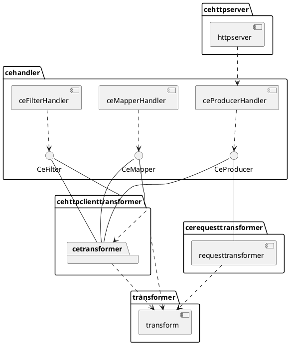

```plantuml
@startuml


package "cehttpserver" {
    [httpserver]
}

package "cehandler" {
  interface CeMapper
  interface CeFilter
  interface CeProducer
  [ceMapperHandler] ..> CeMapper
  [ceFilterHandler] ..> CeFilter
  [ceProducerHandler] ..> CeProducer
  [httpserver] ..> [ceProducerHandler]
}

package "cerequesttransformer" {
    CeProducer -- [requesttransformer]
}

package "cehttpclienttransformer" {
    CeMapper -- [cehttpclienttransformer]
    CeFilter -- [cehttpclienttransformer]
    [cehttpclienttransformer] ..> [cetransformer]
}

package "cetransformer" {
    CeMapper -- [cetransformer]
    CeFilter -- [cetransformer]
    CeProducer -- [cetransformer]
}

package "transformer" {
  [transform]
    [cetransformer] ..> [transform]
    [cehttpclienttransformer] ..> [transform]
    [requesttransformer] ..> [transform]
}
@enduml
```