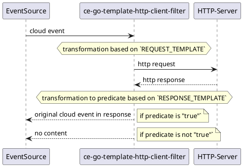

# ce-go-template-http-client-filter




## configuration

| Name | Default | Description |
| ---- | ------- | ----------- |
| `VERBOSE` | `true` | if `true` you get an extensive log output |
| `REQUEST_TEMPLATE` |  | Go template for the transformation of the incoming event to a HTTP-Request in form of [RFC2616](https://tools.ietf.org/html/rfc2616#section-5). Payload of the incoming event is available under `data`. |
| `RESPONSE_TEMPLATE` | | Go template for the transformation of the outcoming HTTP response to the predicate string. |
| `HTTP_JSON_BODY` | `true` | if true marshalls the response payload to a data structure available as `httpresponse.body` |
| `CE_PORT` | `8080` | server port |

## examples

### only women

```bash
REQUEST_TEMPLATE="GET https://api.genderize.io?name={{ .data.name }} HTTP/1.1"$'\n'"content-type: application/json"$'\n'$'\n' RESPONSE_TEMPLATE='{{ eq .httpresponse.body.gender "female" | toString }}' go run cmd/http-client-filter/main.go

## with male name you will get 204
http POST localhost:8080 "content-type: application/json" "ce-specversion: 1.0" "ce-source: http-command" "ce-type: example" "ce-id: 123-abc" name=Sabine
```

