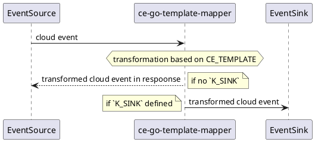

# ce-go-template-mapper



## configuration

| Name | Default | Description |
| ---- | ------- | ----------- |
| `VERBOSE` | `true` | if `true` you get an extensive log output |
| `CE_TEMPLATE` | `{{ toJson .data }}` | identity transformation |
| `CE_SOURCE` | `https://github.com/alitari/ce-go-template` | [Cloudevent Source](https://github.com/cloudevents/spec/blob/v1.0/spec.md#source-1)  |
| `CE_TYPE` | `com.github.alitari.ce-go-template.mapper` | [Cloudevent Type](https://github.com/cloudevents/spec/blob/v1.0/spec.md#type)  |
| `K_SINK` |  | An adressable K8s resource. see [Sinkbinding](https://knative.dev/docs/eventing/samples/sinkbinding/) |
| `CE_PORT` | `8080` | server port |

## examples

### default ( identity transformation) reply mode

```bash
go run cmd/mapper/main.go
# in a new shell
http POST localhost:8080 "content-type: application/json" "ce-specversion: 1.0" "ce-source: http-command" "ce-type: example" "ce-id: 123-abc" person='Alex'
```

### default ( identity transformation) send mode

```bash
K_SINK=https://httpbin.org/post go run cmd/mapper/main.go
# in a new shell
http POST localhost:8080 "content-type: application/json" "ce-specversion: 1.0" "ce-source: http-command" "ce-type: example" "ce-id: 123-abc" person='Alex'
```

### eliminate duplicates

```bash
CE_TEMPLATE='{{ $people := .data.people | uniq }}'\
'{ "people": {{ toJson $people }} }' \
go run cmd/mapper/main.go
# in a new shell
http POST localhost:8080 "content-type: application/json" "ce-specversion: 1.0" "ce-source: http-command" "ce-type: example" "ce-id: 123-abc" \
people:='[ { "name": "Bob", "age": "23" }, '\
'{ "name": "John", "age": "17" } , '\
'{ "name": "Bill", "age": "70"}, '\
'{ "name": "Bob", "age": "23" } ]'
```

### grouping

```bash
CE_TEMPLATE='{{ $people := .data.people }} '\
'{{ $adults := list }} '\
'{{ $children := list }} '\
'{{ range $people }} '\
'  {{ $age := .age | atoi }} '\
'  {{ if gt $age 17 }} '\
'    {{ $adults = append $adults . }}'\
'  {{ else }}'\
'    {{ $children = append $children . }}'\
'  {{ end }} '\
'{{ end }}'\
'{ "adults": {{ toJson $adults }}, "children": {{ toJson $children }} }' go run cmd/mapper/main.go
# in a new shell
http POST localhost:8080 "content-type: application/json" "ce-specversion: 1.0" "ce-source: http-command" "ce-type: example" "ce-id: 123-abc" \
people:='[ { "name": "Bob", "age": "23" }, '\
'{ "name": "John", "age": "17" } , '\
'{ "name": "Bill", "age": "70"}, '\
'{ "name": "Bob", "age": "23" } ]'
```

#### encrypt/decrypt secret parts of event payload

```bash
# encrypt
# start encrypt mapper 
CE_TEMPLATE='{ "foo": {{ toJson .data.foo }}, "secret": "{{ encryptAES (env "SECRET_KEY") (toJson .data.secret) }}" }' SECRET_KEY="mysecretKey" CE_PORT=8070 go run cmd/mapper/main.go
# encrypt event ( use new shell)
http POST localhost:8070 "content-type: application/json" "ce-specversion: 1.0" "ce-source: http-command" "ce-type: example" "ce-id: 123-abc" foo=foovalue secret:='{ "name": "James", "lastName": "Bond"}'
# save the encrypted response part
ENCRYPTED_SECRET=$(http --print=b POST localhost:8070 "content-type: application/json" "ce-specversion: 1.0" "ce-source: http-command" "ce-type: example" "ce-id: 123-abc" foo=foovalue secret:='{ "name": "James", "lastName": "Bond"}' | jq -r .secret)
# decrypt
# start the decrypt mapper (use a new shell)
CE_TEMPLATE='{ "foo": {{ toJson .data.foo }}, "secret": {{ .data.secret | decryptAES (env "SECRET_KEY") }} }' SECRET_KEY="mysecretKey" go run cmd/mapper/main.go
# decrypt encrypted source event 
http --print=Bhb POST localhost:8080 "content-type: application/json" "ce-specversion: 1.0" "ce-source: http-command" "ce-type: example" "ce-id: 123-abc" foo=foovalue secret=$ENCRYPTED_SECRET
```