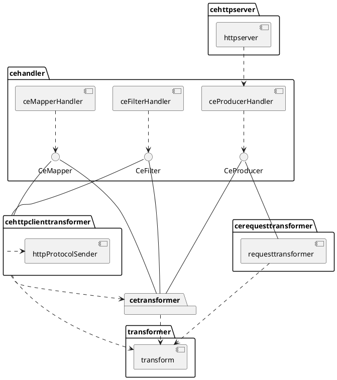

# Development

## build docker images

```bash
for name in "periodic-producer" "http-server-producer" "mapper" "http-client-mapper" "filter" "http-client-filter"
do 
    docker build . -f build/Dockerfile -t docker.io/alitari/ce-go-template-${name} --build-arg main_path=cmd/${name}/main.go
done
```

## architecture



